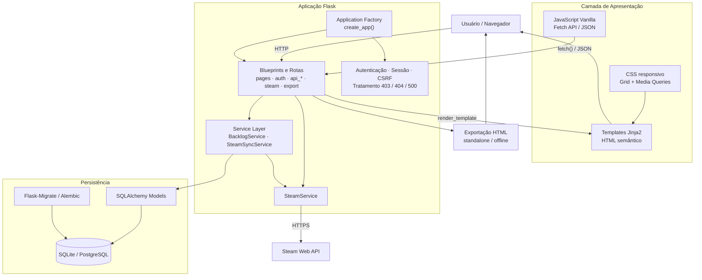

# Arquitetura do SavePoint

O SavePoint utiliza uma arquitetura web em camadas, organizada com **Application Factory**, **Blueprints**, **Service Layer** e persistência por meio do **SQLAlchemy**. A aplicação também possui uma integração externa com a **Steam Web API**.

## Diagrama

## Fluxo principal de dados

1. O usuário acessa o SavePoint pelo navegador.
2. As requisições são recebidas pelas rotas organizadas em **Blueprints Flask**.
3. As páginas são renderizadas com **Jinja2**, enquanto operações dinâmicas utilizam **JavaScript Vanilla** e `fetch()` para consumir endpoints JSON.
4. As principais regras de negócio são concentradas na camada de serviços, especialmente em `BacklogService` e `SteamSyncService`.
5. O acesso aos dados é realizado pelos modelos do **SQLAlchemy**.
6. A aplicação pode utilizar **SQLite** no ambiente local ou **PostgreSQL** por meio de `DATABASE_URL`.
7. A evolução do schema é controlada por **Flask-Migrate/Alembic**.
8. Para sincronização da biblioteca, conquistas e demais informações externas, o backend se comunica com a **Steam Web API** através de `SteamService`.
9. A aplicação também permite gerar uma exportação HTML independente, que pode ser aberta offline.

## Organização arquitetural

### Application Factory

A aplicação é criada por `create_app()`, responsável por carregar configurações, inicializar extensões, registrar Blueprints, handlers de erro, context processors e cabeçalhos de segurança.

### Blueprints e rotas

As responsabilidades HTTP são separadas em módulos como:

- páginas da aplicação;
- autenticação;
- API de jogos;
- API de runs;
- API de builds;
- API de desafios;
- API de estatísticas;
- integração Steam;
- exportação.

### Service Layer

A camada de serviços concentra regras de negócio e integração, evitando que toda a lógica fique diretamente nas rotas. Entre as classes principais estão:

- `BacklogService`;
- `SteamService`;
- `SteamSyncService`.

### Persistência

Os dados são representados por modelos SQLAlchemy, incluindo usuários, jogos, categorias, conquistas, histórico, builds, runs e desafios. O schema é versionado com Alembic.

### Frontend

A interface utiliza:

- HTML semântico por meio de templates Jinja2;
- CSS responsivo com Grid e media queries;
- JavaScript Vanilla;
- Fetch API para comunicação JSON com o backend;
- práticas básicas de acessibilidade, como labels e atributos ARIA.
